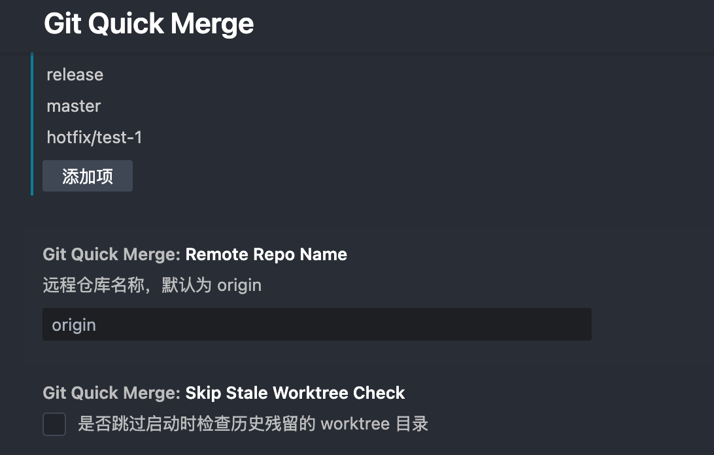
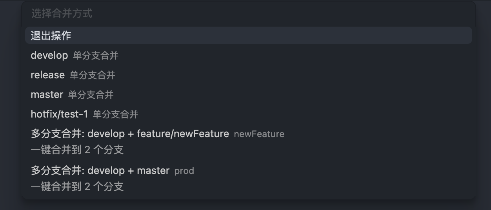

# vscode-git-quick-merge

---

快速将当前分支合并到指定分支，无需切换分支。

A VSCode extension for quickly merging the current branch to specified branches without switching branches.





### 工作原理 / How It Works

本扩展的合并操作大致等同于以下 Git 命令序列：
```bash
git checkout B -> git pull -> git merge A -> git push -> git checkout A
```

但是使用 `git worktree` 技术实现，**不会对本地分支做任何修改**，确保您的当前工作环境完全不受影响。

This extension's merge operation is roughly equivalent to the following Git command sequence:
```bash
git checkout B -> git pull -> git merge A -> git push -> git checkout A
```

However, it uses `git worktree` technology, ensuring **no modifications are made to your local branches** and your current working environment remains completely unaffected.

### Features

- **快速分支合并**：无需切换到目标分支，直接将当前分支合并到指定分支
- **Quick Branch Merge**: Merge current branch to specified target branches without switching away from your current branch

- **预设多分支合并**：配置预设的分支组合，一键合并到多个目标分支（如配置"HotFix"包含 develop+master）
- **Preset Multiple Branch Merge**: Configure preset branch combinations for one-click merging to multiple target branches (e.g., configure "HotFix" with develop+master)

- **无干扰**：使用 git worktree，当前工作目录文件不会被变更，不会中断或影响正在进行的构建/开发环境
- **Non-disruptive**: Uses git worktree to ensure files in your current working directory remain unchanged, preventing interruption to ongoing builds or development environments

- **自定义目标分支**：在设置中配置你常用的目标分支（develop、release、master 等）
- **Configurable Target Branches**: Set up your preferred target branches (develop, release, master, etc.) in settings

- **历史残留清理**：自动检测并清理失败残留的 worktree 目录
- **Stale Worktree Cleanup**: Automatically detect and clean up leftover worktree directories

### 预设合并配置示例 / Merge Presets Configuration Example
```json
{
  "gitQuickMerge.mergePresets": [
    {
      "name": "测试环境",
      "branches": ["develop", "test"]
    },
    {
      "name": "预发布",
      "branches": ["develop", "release"]
    },
    {
      "name": "发布到生产",
      "branches": ["develop", "release", "master"]
    },
    {
      "name": "GitFlow完整流程",
      "branches": ["develop", "release", "master"]
    }
  ]
}
```

---

**Enjoy!**
