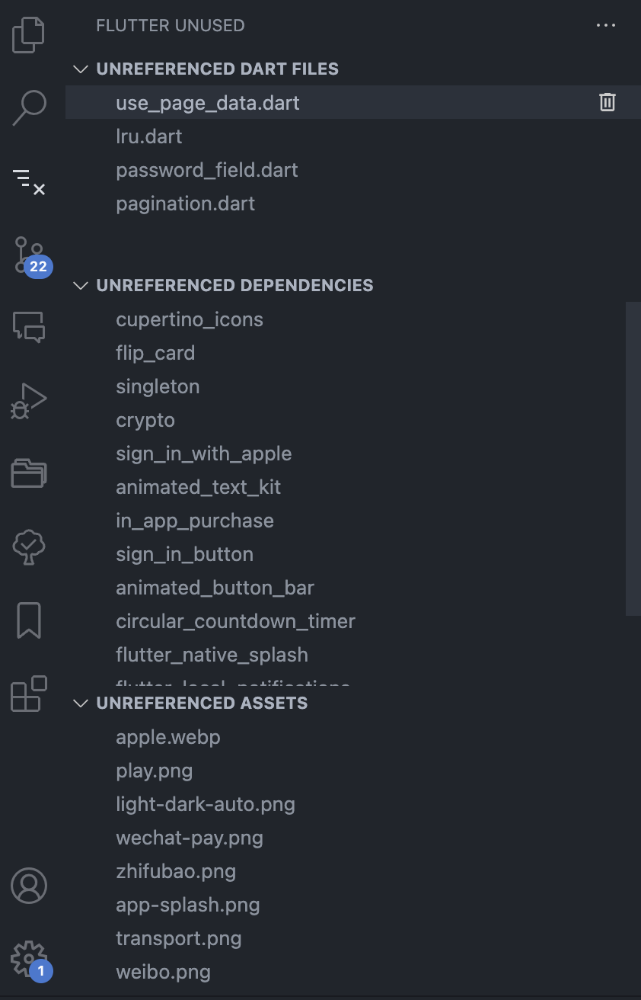

# flutter-unused

This extension is used to find unused files & dependencies in a flutter project.

## Features

## For more information

- [Visual Studio Code's Markdown Support](http://code.visualstudio.com/docs/languages/markdown)

**Enjoy!**
